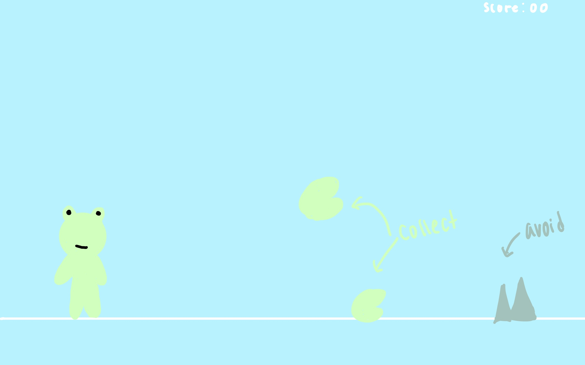
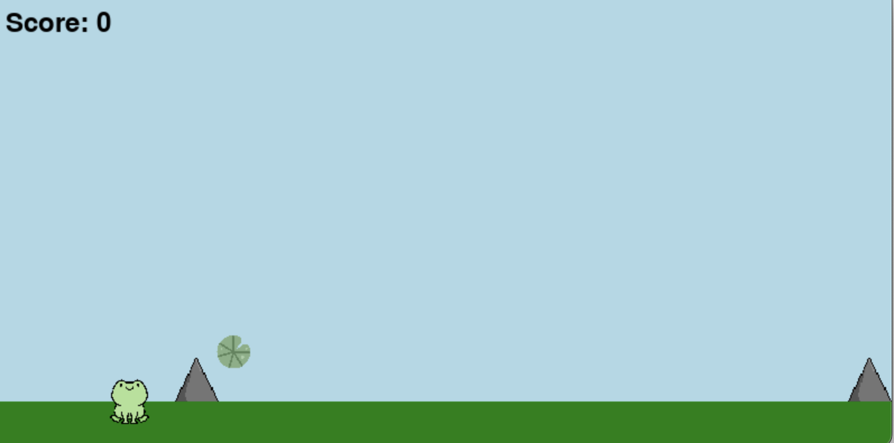

:warning: Everything between << >> needs to be replaced (remove << >> after replacing)

# Frog run
## CS110 B1 Final Project Fall, 2024

## Team Members

Anna Lei

***

## Project Description

The player would be a frog and they would have to jump over obstacles but they would also have to collect lily pads and it would give them points. When the player reaches a certain amount of point, they win the game. If they hit an obstacle, it would be game over.

***    

## GUI Design

### Initial Design

### Final Design

## Program Design

### Features

1. moveable character
2. obstacles
3. points/rewards system
4. moving background
5. game over screen

### Classes

- Frog: Creates a frog that can jump with the influence of gravity. It's a 2D frog that starts at the x, y position and when the frog jumps, the position will be updated based on gravity.
- Obstacle: Creates the obstacles in the game which are spikes that can detect when the frog collides with the obstacle.
- Points: Creates a lily pad that the frog can collect and give the player points and contribute to the score. This class handles the positioning, collision detection, and collection status of the lily pads.

## ATP

| Step                 |Procedure             |Expected Results                   |
|----------------------|:--------------------:|----------------------------------:|
|  1                   | Run Counter Program  |GUI window appears with count = 0  |
|  2                   | click count button   | display changes to count = 1      |
etc...
